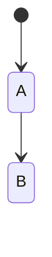
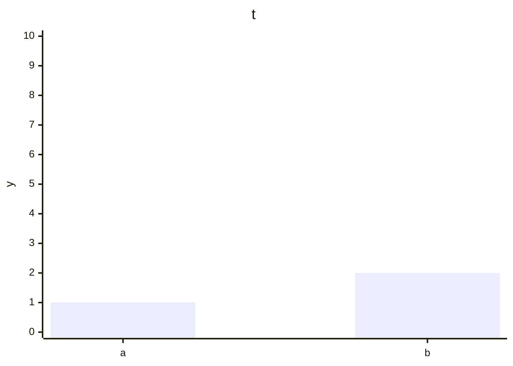
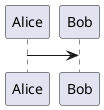

# Edge

## Chart



## Beta



## Named



## Formula

```math
\begin{align} a &= b \end{align}
```

## Cost

```math
$x + y$ costs \$5 total
```

## Table

```csv
name,note,age
"Doe, Jane","said ""hi""",32
plain,x,1
```

## Shape

```geojson
{"type": "FeatureCollection", "features": [{"type": "Feature", "geometry": null}]}
```

## Mesh

```stl
SOLID cube
ENDSOLID cube
```

## Tune

```abc
X: 10
T:Scale
CDEFGAB
```
