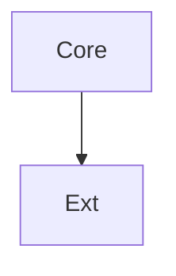
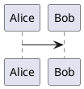

# Release Notes

## Diagram



## Uml



## Formula

```math
$E = mc^2$
```

## Tune

```abc
X:1
T:Scale
CDEFGAB
```

## Table

```csv
name,value
latency,120
uptime,99
```

## Shapes

```geojson
{"type": "FeatureCollection", "features": []}
```

## Topo

```topojson
{"type": "Topology", "arcs": []}
```

## Mesh

```stl
solid cube
facet normal 0 0 0
endsolid cube
```
