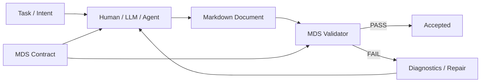
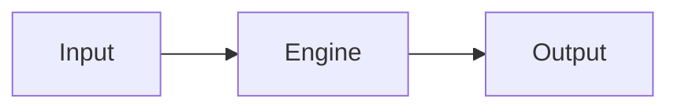
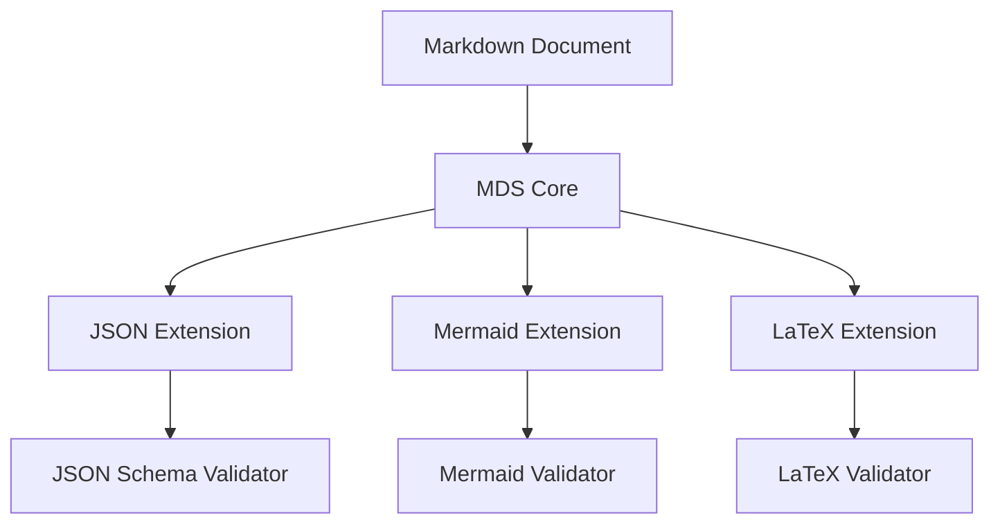
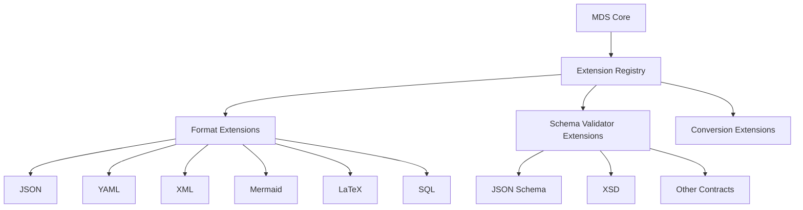
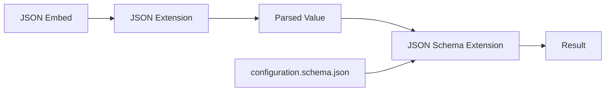
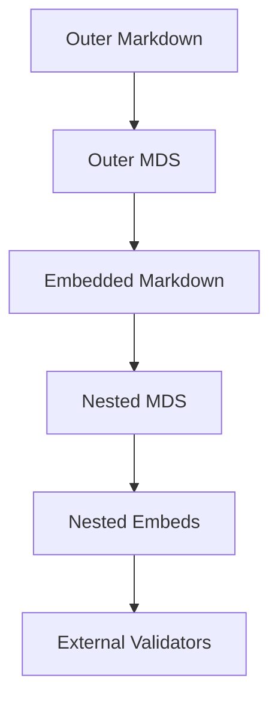
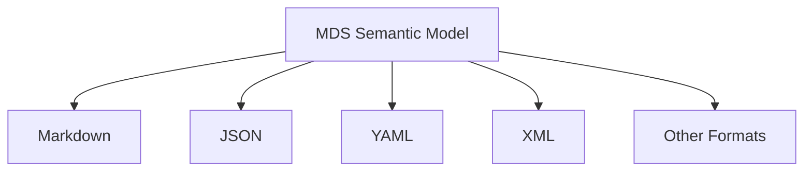
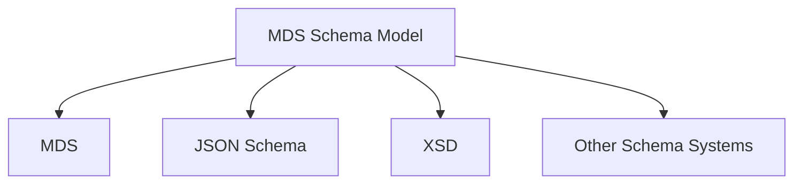
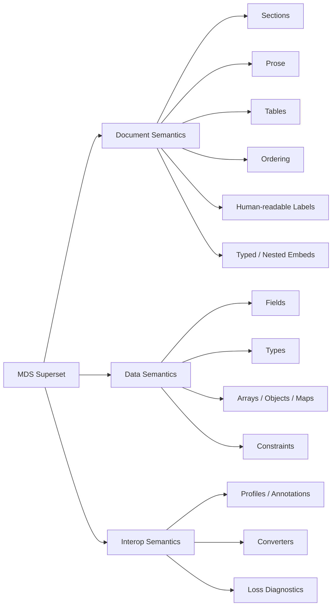

# MDS — Markdown Document Schema Specification

**Version:** 0.17.2
**Status:** Beta
**Name:** MDS — Markdown Document Schema
**Schema extension:** `.mds`
**Primary instance format:** `.md`

---

# Indent

**MDS turns Markdown from an informal document format into a contract-driven, testable and machine-verifiable document system.**

For AI-generated documents, MDS goes one step further: the same contract can describe both the structure that must exist and the semantic content that is expected inside that structure.

```mds
## Purpose required

prose required minLength=50

expect:
  Explain why this component exists, which problem it solves,
  and where its responsibility ends. Do not describe implementation details.
```

The structural part is deterministic and testable. `expect` is a native semantic expectation that a human, LLM or agent can read directly while generating the document. A semantic-validation extension MAY additionally evaluate that expectation when such validation is desired.

This creates a single document contract for both generation and acceptance:

```text
task + .mds contract
        ↓
human / LLM / agent
        ↓
Markdown document
        ↓
MDS structural validation
        ↓
optional semantic validation
```

The contract tells the author not only what must be present, but what belongs there.

Markdown is already the default language for technical documentation, AI-generated content, architecture descriptions, ADRs, runbooks, specifications and developer workflows.

Its weakness is simple:

> Markdown has structure, but no native way to define what a valid document must contain.

A team can say:

> Every architecture document must contain Purpose, Context, Components, Interfaces, Risks and a Mermaid diagram.

A prompt can tell an LLM the same thing.

But neither provides a deterministic guarantee that the resulting document actually follows that structure.

MDS adds that missing layer.

```text
Markdown + MDS
=
human-readable document
+
formal structure
+
type system
+
semantic expectations
+
validation contract
+
generation contract
+
machine introspection
```

An MDS schema can be given to a human, an LLM or an autonomous agent as the exact specification for a document.

The resulting Markdown can then be validated automatically.



This changes documentation from:

> "Please follow this template."

into:

> "This document must satisfy this executable contract."

---

# Why MDS Matters

## 1. LLM Output Becomes Testable

LLMs are excellent at producing Markdown.

They are not deterministic about structure.

They may:

* omit sections,
* rename headings,
* invent extra sections,
* produce malformed tables,
* forget required fields,
* generate invalid Mermaid,
* return incomplete JSON,
* break requested ordering,
* ignore subtle formatting requirements.

Today these failures are usually discovered by humans.

With MDS:

```text
Prompt
+
MDS contract
↓
LLM
↓
Markdown
↓
MDS validation
↓
PASS / FAIL
```

The same contract used to describe the requested output becomes the acceptance test for the generated output.

With `expect`, the contract also carries the semantic generation intent for each document region. Instead of moving those instructions into a separate prompt template, MDS keeps structural rules and content expectations together in one directly LLM-readable specification.

This makes MDS particularly well suited for:

```text
AI agents
coding agents
documentation agents
architecture generation
ADR generation
technical specifications
reports
runbooks
knowledge-base generation
automated research outputs
```

---

# 2. Documentation Becomes Executable

Most organizations maintain documentation standards as:

* templates,
* examples,
* wiki pages,
* style guides,
* prompt instructions,
* tribal knowledge.

These are advisory.

MDS makes them executable.

Instead of:

```text
All engine documents should contain:
Purpose
Inputs
Outputs
Dependencies
Risks
```

a project defines:

```text
engine.mds
```

and CI enforces:

```bash
mds validate engine.md engine.mds
```

Documentation can therefore be treated like other engineered artifacts:

```text
Code          → tests
API           → OpenAPI contract
Database      → schema
Markdown docs → MDS contract
```

---

# 3. Markdown Keeps Its Biggest Advantage

The goal is NOT to replace Markdown with another verbose structured format.

The instance remains normal Markdown:

```markdown
# Signal Engine

## Purpose

Calculates normalized cross-asset signals.

## Inputs

| Name | Type | Source |
|---|---|---|
| price | number | market-bars |
| volume | number | market-bars |
```

The schema provides structure separately:

```mds
# "*" as title required

## Purpose required
prose required

## Inputs required

table required
- Name: string required
- Type: string required
- Source: string required
```

Humans edit Markdown.

Machines enforce MDS.

---

# 4. Structured Documents Without JSON/XML Noise

JSON, YAML and XML are excellent structured data formats.

They are less natural for long human documents containing:

* prose,
* headings,
* tables,
* diagrams,
* code,
* examples,
* nested explanations.

MDS allows these constructs to remain native Markdown while still becoming formally structured.

```text
JSON / YAML
    primarily structured data

Markdown
    primarily human documents

Markdown + MDS
    structured data
    +
    structured documents
```

MDS can validate from the top-level document structure all the way down to individual typed fields.

---

# 5. Recursive Multi-Format Validation

Modern technical Markdown documents frequently contain other languages.

For example:

````markdown
## Configuration

```json
{
  "window": 20
}
```

## Architecture



## Formula

```latex
P(x) = ...
```
````

MDS treats these as typed embedded regions.

Example:

```mds
## Configuration required

embed json required
  schema: ./configuration.schema.json

## Architecture required

embed mermaid required

## Formula optional

embed latex optional
```

The MDS Core does not need to understand every language.

Validation is delegated to modular extensions.



This means a single Markdown document can have a recursive validation tree spanning multiple formats and schema technologies.

---

# 6. The Document Can Describe Its Own Contract Requirements

MDS documents are introspectable.

A tool can ask a schema:

```text
Which sections are required?
Which sections may repeat?
Which tables are expected?
Which columns are mandatory?
Which fields are typed?
Which embedded formats occur?
Which external schemas are required?
Which validators are needed?
```

This allows tooling to automatically:

* generate editor assistance,
* construct LLM prompts,
* build forms,
* generate templates,
* validate outputs,
* generate documentation skeletons,
* discover plugin dependencies.

MDS is therefore not merely a validator.

It is a **machine-readable model of the expected document**.

---

# 7. One Contract for Human and Machine Authors

The same schema can serve:

```text
Human author
LLM
Agent
IDE
CI pipeline
Documentation generator
Validator
```

That is important.

Without MDS, each system often gets its own interpretation of a document template.

With MDS:

```text
                     architecture.mds
                           │
          ┌────────────────┼────────────────┐
          │                │                │
        Human             LLM              IDE
          │                │                │
          └────────────────┼────────────────┘
                           ↓
                    architecture.md
                           ↓
                     MDS Validator
```

There is one source of truth.

---

# 8. MDS Adds Contracts Without Destroying Markdown

MDS does not turn Markdown into XML.

It does not require wrappers around every paragraph.

It does not require JSON-like brackets.

It does not require YAML indentation for the document itself.

Its design goal is:

> Keep the document optimized for humans while adding a separate formal contract optimized for machines.

---

# 9. MDS Is a Document Schema, Not Just a Data Schema

MDS can express constructs that are natural in documents:

```text
section hierarchy
section ordering
required prose
optional prose
repeated sections
tables
human labels
structured fields
nested content
embedded languages
document composition
```

At the same time it can express data-oriented constraints:

```text
string
integer
number
boolean
date
enum
array
object
required
optional
min/max
pattern
unique
```

This gives MDS a broader document model than traditional data-only schemas.

---

# 10. Positioning

The closest conceptual analogy is:

```text
OOXML / DOCX + formal document schemas
ODF / ODT    + formal document schemas
Markdown     + MDS
```

For data-oriented formats:

```text
JSON + JSON Schema
XML  + XSD
```

The concise positioning is therefore:

> **MDS is to Markdown what formal schema languages are to structured XML documents.**

For modern AI workflows:

> **Prompts describe what an LLM should produce. MDS proves whether the result actually conforms.**

---

# 11. Key Differentiators

MDS combines capabilities that are usually separate.

| Capability                        | Plain Markdown | JSON/YAML schemas | MDS |
| --------------------------------- | :------------: | :---------------: | :-: |
| Human-readable prose              |              ✓ |                      limited |   ✓ |
| Headings / sections               |              ✓ |                    unnatural |   ✓ |
| Structured fields                 |        limited |                            ✓ |   ✓ |
| Typed values                      |              ✗ |                            ✓ |   ✓ |
| Required sections                 |              ✗ |                data-oriented |   ✓ |
| Section order                     |              ✗ |                      limited |   ✓ |
| Tables as typed records           |              ✗ |                     indirect |   ✓ |
| Embedded languages                |              ✓ |              usually strings |   ✓ |
| External validator delegation     |              ✗ |      limited/domain-specific |   ✓ |
| Recursive schema validation       |              ✗ | possible but format-specific |   ✓ |
| LLM generation contract           |       informal |                data-oriented |   ✓ |
| Deterministic document validation |              ✗ |                    data only |   ✓ |
| Introspection                     |           weak |                            ✓ |   ✓ |
| Human-first authoring             |              ✓ |                       weaker |   ✓ |

---

# 12. Primary Use Cases

MDS is designed to be especially suitable for:

```text
architecture documents
technical specifications
ADRs
design documents
runbooks
operating procedures
research reports
experiment reports
API documentation
data-source documentation
engine specifications
system design documents
AI-generated reports
agent outputs
knowledge-base documents
compliance documentation
documentation CI
```

---

# Technical Specification

Conformance language: the key words MUST, MUST NOT, SHOULD, SHOULD NOT and MAY in this specification are to be interpreted as described in RFC 2119. MUST and MUST NOT apply to conforming implementations. SHOULD indicates a strong recommendation; deviations require justification. MAY marks a genuinely optional capability.

# 13. Core Definition

MDS is a schema language defining the valid semantic structure of Markdown documents.

MDS defines:

```text
document types
sections
nested sections
ordering
cardinality
prose regions
semantic expectations
fields
lists
tables
types
constraints
references
composition
conditions
embedded regions
extension requirements
diagnostics
```

---

# 14. Core Architecture


The Markdown AST is an implementation detail.

MDS operates on a normalized semantic document model.

Normalization rules (normative minimum):

```text
surrounding whitespace of headings, labels and values is trimmed
internal runs of whitespace collapse to a single space
comparison of headings and field labels is case-sensitive
emphasis markers (*, _, `) on headings and labels are ignored for matching
skipped heading levels do not create implicit intermediate sections
```

---

# 15. Semantic Document Model

Conceptually:

```text
Document
├── Metadata
├── Title
├── Expectations
├── Fields
└── Sections
    ├── Expectations
    ├── Prose
    ├── Fields
    ├── Lists
    ├── Tables
    ├── Embeds
    └── Sections
```

This semantic model is the basis for validation and introspection.

## Metadata Region

Metadata is an optional region at the very start of the document, delimited by `---` lines and containing flat `key: value` pairs:

```markdown
---
id: engine-042
status: draft
---

# Signal Engine
```

MDS Core recognizes only flat `key: value` pairs in this region. This format is deliberately a minimal subset. Full front-matter dialects such as nested YAML remain the domain of a format extension.

MDS Core therefore does not implement a YAML parser.

Normative status: this syntax is **MDS metadata syntax, not YAML**, even though it visually resembles a YAML subset. Metadata values are plain strings unless a schema explicitly declares a type for the entry. Implementations MUST NOT apply YAML implicit typing or YAML node features. In particular:

```text
yes / on        the strings "yes" / "on", never booleans
0123            the string "0123"
2026-08-25      the string "2026-08-25" unless declared as date
&anchor *alias  ordinary literal characters
```

Undeclared metadata entries follow the document-level `additionalFields` setting.

---

# 16. Structural Correspondence

Schemas SHOULD resemble the documents they define.

Markdown:

```markdown
# Person

## Identity

- Name: Anna
- Age: 32
```

MDS:

```mds
# Person required

## Identity required

- Name: string required
- Age: integer optional
```

This principle is known as **structural correspondence**.

---

# 17. Document Types

A schema MAY define a logical document type.

```mds
document Architecture
```

Example:

```mds
document Architecture

# "*" as title required
```

Multiple differently titled documents can therefore share one contract.

Heading patterns support exactly one wildcard form: a quoted label containing `*`, where `*` matches any non-empty character sequence. Everything else in the pattern is literal. Unquoted headings must match literally after normalization.

---

# 18. Sections

Markdown headings define semantic sections.

Example:

```markdown
# Engine

## Inputs

### Market Data

### Metadata

## Outputs
```

Semantic structure:

```text
Engine
├── Inputs
│   ├── Market Data
│   └── Metadata
└── Outputs
```

Schema:

```mds
# "*" as title required

## Inputs required

### Market Data required
### Metadata optional

## Outputs required
```

---

# 19. Ordering

MDS MUST support document ordering constraints.

```mds
order strict

## Purpose required
## Context required
## Inputs required
## Outputs required
## Risks required
```

Order-independent structures MAY use:

```mds
order any
```

If no `order` directive is present, the default is `order any`.

Under `order strict`, all occurrences of a declared section MUST form one contiguous group at the position where the section is declared. Repeated sections therefore never interleave with other sections.

---

# 20. Cardinality

Minimum supported cardinalities:

| Keyword       | Meaning      |
| ------------- | ------------ |
| `required`    | exactly one  |
| `optional`    | zero or one  |
| `one-or-more` | one or more  |
| `zero-or-more`| zero or more |

An omitted cardinality defaults to `required`.

Example:

```mds
## Summary required
## Example one-or-more
## Notes optional
```

Optional shorthand MAY include:

```text
? optional
* zero-or-more
+ one-or-more
```

---

# 21. Prose

Prose is a first-class schema type.

```mds
## Purpose required

prose required
```

Constraints MAY include:

```mds
prose required minLength=50 maxLength=2000
```

`minLength` and `maxLength` count Unicode code points of the prose text.

A section has at most one prose region.

Future versions MAY define additional prose constraints.

## Semantic Expectations (expect)

MDS Core MUST support semantic expectations through the `expect` statement.

`expect` describes what content belongs in a schema-defined document region. It is intended to be read directly by human authors, LLMs and agents during generation.

Example:

```mds
## Purpose required

prose required minLength=50

expect:
  Explain why this engine exists, which business or technical problem it solves,
  and where its responsibility ends. Do not describe implementation details.
```

The distinction is normative:

```text
structure / types / constraints   deterministic contract; Core validates them
expect                            semantic generation intent; Core exposes it
semantic validator extension      may evaluate expect when explicitly configured
```

`expect` MUST NOT by itself change the deterministic Core validation verdict. A document can therefore be structurally valid even when a human considers its prose semantically poor. This boundary keeps Core validation deterministic.

A semantic-validation extension MAY consume `expect` and emit extension diagnostics. If a project explicitly makes such semantic validation required, those extension diagnostics MAY affect the overall validation verdict under the normal extension rules.

### Semantic Validation Binding

A schema region MAY declare how its expectation is evaluated through the `validate` statement, using the same attachment rules as `expect`:

```mds
expect:
  Explain why the engine exists, its responsibility and boundaries.

validate:
  semantic: optional
```

Core MUST parse and expose this binding; Core itself never evaluates an expectation — it only knows that a semantic expectation exists and whether its evaluation is required.

The value of `semantic` is `optional` or `required`. With `optional`, a semantic-validation extension SHOULD run when one is installed; without one the region stays valid. With `required`, evaluation MUST be possible: when no semantic-validation extension is available, Core emits MDS-E410 and the run fails. When an extension evaluates an expectation, its findings are extension diagnostics in the `MDS-E4xx` range and MAY affect the overall verdict under the normal extension rules.

Semantic-validation extensions register through the same zero-config mechanism as format extensions (npm packages `mds-ext-semantic-*` or scoped `@mds/*`, Python entry-point group `mds_ext`) and expose a `validators` list beside `formats`.

`expect` MAY be attached to:

```text
document
section
prose region
field
list
table
table column
embed
```

A schema-defined region has at most one `expect` statement. The value is free-form UTF-8 text and MAY span multiple indented lines. The text is preserved as semantic guidance; MDS Core does not interpret, summarize or rewrite it.

Examples:

```mds
document Architecture

expect:
  Produce a self-contained architecture specification sufficient for another
  engineer to understand responsibilities, interfaces, major decisions and risks.
```

```mds
## Risks required

expect:
  Identify concrete technical or operational failure scenarios, not generic concerns.

table Risks one-or-more

- Risk: string required
  expect:
    Describe the failure scenario.

- Impact: string required
  expect:
    Describe the observable consequence if the risk materializes.

- Mitigation: string required
  expect:
    Describe a specific action that reduces probability or impact.
```

For embedded content:

```mds
## Architecture Diagram required

expect:
  Show the major runtime components, directional data flow and external dependencies.
  Omit deployment infrastructure unless it is architecturally relevant.

embed mermaid required
```

`expect` is part of MDS introspection. A conforming implementation MUST expose the expectation together with the region to which it belongs.

This makes the `.mds` file directly usable as an LLM generation specification: no translation into JSON, a secondary prompt description or another intermediate representation is required.

---

# 22. Fields

Markdown field lists MAY map to typed values.

Markdown:

```markdown
- Symbol: AAPL
- Active: true
- Weight: 0.25
```

MDS:

```mds
- Symbol: string required
- Active: boolean required
- Weight: number required min=0 max=1
```

Field interpretation rule (normative):

A list item is interpreted as a field if and only if it has the form `Label: value` and `Label`, compared after normalization, matches a field declared for this section by human label or semantic identifier. Only the first colon separates label and value; further colons belong to the value.

All other list items are elements of the section's list. A section that declares no fields treats every list item as a plain list element, even if it contains a colon.

A field present in the document is always type-checked against its declaration regardless of cardinality; whether its value may be empty is decided solely by `nullable` (section 23.1).

---

# 23. Native Types

MDS SHOULD support:

```text
string
integer
number
boolean
null
date
datetime
time
duration
uri
uuid
binary
any
```

Normative encodings:

```text
date     ISO 8601 calendar date (YYYY-MM-DD)
datetime RFC 3339
time     RFC 3339 time
duration ISO 8601 duration
uri      RFC 3986
uuid     RFC 4122 canonical hyphenated form
binary   Base64 (RFC 4648)
boolean  exactly `true` or `false`
null     empty value or the literal `null`
number   decimal point `.`, optional sign and exponent, no group separators
integer  number without fractional part
string   raw text after normalization
```

### 23.1 Structural Absence versus Data Absence

MDS strictly separates two kinds of "missing". Confusing them is the single most common contract mistake, so the distinction is normative:

```text
STRUCTURAL ABSENCE — the element itself is missing.
  The bullet, the column, the section does not exist in the document.
  Governed by CARDINALITY: required | optional.

DATA ABSENCE — the element exists, but its value is unknown.
  The bullet is there ("- Age:"), the cell is there — but empty,
  or written as null, or as a declared placeholder such as na.
  Governed by NULLABLE.
```

Form analogy: a form without a line for "middle name" is structural absence; a present line left blank is data absence. MDS documents are forms.

**The master matrix.** "Present but empty" means an empty value, the literal `null`, or a declared placeholder token:

| Declaration | Element missing entirely *(structural)* | Present, but empty *(data)* | Present with a concrete value |
|---|---|---|---|
| `- Age: integer` | ❌ missing-field error | ❌ type error | ✅ |
| `- Age: integer optional` | ✅ | ❌ type error | ✅ |
| `- Age: integer nullable` | ❌ missing-field error | ✅ null | ✅ |
| `- Age: integer optional nullable` | ✅ | ✅ null | ✅ |

Read each column as one question: *may it be absent?* (`optional`) versus *may it be empty?* (`nullable`). A concrete value is always accepted; that is what the type is for.

Field example — the same section three ways:

```text
## Identity            ## Identity            ## Identity
- Name: Anna           - Name: Anna           - Name: Anna
                       - Age:                 - Age: 32
Age absent entirely    Age present, empty     Age present, concrete
(structural)           (data absence)         (normal case)
```

Table example — why one keyword can never substitute for the other. A Markdown table is rectangular: a column exists for all rows or for none.

```text
B column removed entirely    B column present, one cell empty
| A |                        | A | B |
|---|                        |---|---|
| 1 |                        | 1 |   |
                             | 2 | 5 |
structural → optional        data absence → nullable
(applies to ALL rows)        (decided per cell)
```

Consequently `optional` can never express "this cell may be empty", and `nullable` can never express "omit this column".

**Placeholder tokens.** The tokens meaning "no value" are exactly:

```text
immutable core (always, every nullable declaration):
  ""          the empty value (empty cell, "- X:" with nothing after the colon)
  null        the literal word

declared extras:
  nullable(na)             na additionally counts as "no value"
  nullable(na, n/a, -)     several extras, comma-separated, spaces allowed
```

Extras EXTEND the core; they never replace it. Matching is exact and case-sensitive. Without the `nullable` flag nothing is treated as null: even the literal `null` fails an `integer` check like any other text.

**Normative evaluation order per value:**

```text
1. raw matches a null token of the declaration  → value IS null;
   type check and constraints are skipped entirely
2. otherwise type check                          → C301/C303/C304/…
3. otherwise constraints                         → C302/…
```

Consequences, all normative:

- Constraints (`min`, `pattern`, …) apply only to concrete values; null bypasses them.
- Under `unique`, two null values are EQUAL to each other (SQL DISTINCT semantics): a row of only-null unique cells duplicates itself.
- The canonical semantic model stores the JSON value `null`, never the token text.
- Applicability: `nullable` MAY appear on typed fields, table columns, list element declarations and metadata entries. It MUST NOT appear on sections, `prose` or `embed` declarations (those have occurrence cardinality only); violations fail schema processing with `MDS-C007`.
- An extra token that is already a member of the declared value language (for example `nullable(0)` on `integer`, or a token equal to an `enum` value or a `const`) is almost certainly a data error and MUST fail schema processing with `MDS-C008`. Tokens on `string`, `any` or `null` bases are exempt from this guard. Zero (`0`) is a number, not "no value" — surveys encoding "no answer" as 0 must use a distinct placeholder instead.
- Arrays and maps are out of scope for `nullable`; combining them MUST fail with `MDS-C007`.

**Feedback for LLM repair loops.** When a value fails its type check and the raw value is empty, validators SHOULD append the hint `; declare "nullable" to allow missing values`. Conversely, `missing required field/column` points at structural absence: the repair is `optional` (or adding the element), never `nullable`.

**Draft interaction.** The draft command infers column and field types from observed concrete values only. Any observed empty value marks the declaration `nullable` — never `optional`, which would wrongly encode a data observation as a structural one. Drafted contracts therefore self-validate over their source documents including their gaps.

---

# 24. Composite Types

MDS SHOULD support:

```text
object
array
map
enum
union
```

Examples:

```mds
- Tags: string[]
```

```mds
- Status: enum[draft, review, approved]
```

```mds
- Value: union[string, number]
```

```mds
- Address: object required
  - Street: string required
  - City: string required
```

```mds
- Labels: map[string] optional
```

Object members are nested list items in the instance:

```markdown
- Address:
  - Street: Hauptstrasse 1
  - City: Berlin
```

---

# 25. Schema-Driven Typing

The schema determines semantic type interpretation.

Markdown:

```markdown
- Identifier: 00123
```

Schema:

```mds
- Identifier: string
```

Result:

```text
"00123"
```

Schema:

```mds
- Identifier: integer
```

Result:

```text
123
```

MDS MUST NOT rely exclusively on uncontrolled type inference.

---

# 26. Lists

Markdown lists MAY map to typed collections.

```markdown
- equity
- crypto
- fx
```

Schema:

```mds
list string required
```

Logical result:

```text
["equity", "crypto", "fx"]
```

A section has at most one unnamed list in MDS 1.0. Whether an individual list item is a list element or a field is defined by the field interpretation rule in section 22.

---

# 27. Tables

Markdown tables are first-class structured collections.

Markdown:

```markdown
| Name | Type | Required |
|---|---|---|
| price | number | true |
| volume | number | false |
```

MDS:

```mds
table Inputs required

- Name: string required
- Type: string required
- Required: boolean required
```

MDS MAY constrain:

```text
column names
column order
column types
required columns
optional columns
row cardinality
uniqueness
cell constraints
```

Binding rules (normative):

Tables bind to table declarations positionally, in document order within their section. The declaration name (`table Inputs`) is a stable identifier for introspection, references and diagnostics; it is not matched against document text. A section containing exactly one table MAY use the unnamed form `table required`.

By default, declared columns MAY appear in any order. Columns not declared by the schema follow the `additionalFields` setting of their section. An empty cell represents `null` exactly where the column declares `nullable`; otherwise the cell is type-checked like any field value (section 23.1). Column presence is structural (`required`/`optional`, decided per column for all rows); emptiness of an individual cell is a data property (`nullable`, decided per cell). `minItems` and `maxItems` constrain row counts; `unique` compares whole rows and treats two null values as equal.

The table name is the semantic identifier and never needs to appear literally in the Markdown, mirroring human labels versus semantic identifiers (section 28). Positional binding therefore avoids fragile matching over visible document text.

---

# 28. Human Labels and Stable Identifiers

Human labels MAY differ from stable machine identifiers.

```mds
## "Risk Analysis" as risk required

- "Volatility Estimate" as volatility: number required
```

Markdown:

```markdown
## Risk Analysis

- Volatility Estimate: 0.24
```

Semantic path:

```text
risk.volatility
```

---

# 29. Constraints

String constraints SHOULD include:

```text
minLength
maxLength
pattern
enum
const
```

Numeric constraints SHOULD include:

```text
min
max
exclusiveMin
exclusiveMax
multipleOf
```

Collection constraints SHOULD include:

```text
minItems
maxItems
unique
```

---

# 30. Defaults

Schemas MAY define defaults.

```mds
- Active: boolean default=true
```

Explicit and schema-supplied values MUST remain distinguishable.

---

# 31. Unknown Content

A contract binds exactly what it declares — binding is opt-in per declaration. Declaring a parent section does NOT constrain its subtree: child headings that no declaration matches are legal by default, together with any prose, fields, tables, lists or embeds they contain. Nothing binds there, so nothing can fail there; an LLM filling such a region stays free and the document remains valid.

```mds
## Details required       # only this heading is bound
                          # everything nested below: unconstrained
```

Schemas MUST support controlling undeclared structures.

```mds
additionalSections false
additionalFields false
```

or:

```mds
additionalSections true
additionalFields true
```

Defaults: both directives are `true` when not declared. When placed inside a section, a directive applies to that section only; at document level it applies to the whole document.

Under `additionalSections false`, a section heading that no declaration matches fails with `MDS-C102` (unexpected section). Under `additionalFields false`, an undeclared field fails with `MDS-C207` and an undeclared table column with `MDS-C307`. These flags never affect missing-but-declared content, which keeps failing with `MDS-C101`/`MDS-C206`. One exception exists even under a fully closed contract: the first level-1 heading of the document remains free while no title declaration (`# …`) exists, because every Markdown document needs a title.

Rationale: the permissive default fits exploratory authoring and LLM generation; a closed contract (`false`) is a strong guarantee that projects SHOULD activate deliberately for production specifications.

Informative: a closed-contract shorthand such as `profile strict` may be considered after 1.0; it is reserved and not part of MDS 1.0.

---

# 32. Reusable Definitions

MDS MUST support reusable definitions.

```mds
define Identifier
  string pattern="^[a-z][a-z0-9_-]+$"
```

Usage:

```mds
- id: Identifier required
```

Complex reusable structures SHOULD also be supported.

---

# 33. References

MDS schemas MUST support references.

```mds
use "./common.mds"
```

Example:

```mds
- Owner: common.Owner required
```

A URI-compatible canonical reference syntax SHOULD exist.

```mds
$ref "./common.mds#Owner"
```

Resolution rules (normative):

Relative paths resolve against the directory of the referencing schema file. Each imported file forms a namespace named after its file stem (`common.Person`). Import cycles MUST produce a diagnostic. `use` and `$ref` are equivalent mechanisms; `$ref` is the canonical URI-compatible form.

---

# 34. Composition

MDS SHOULD support:

```text
allOf
anyOf
oneOf
not
```

Example:

```mds
oneOf
  Equity
  Future
  Option
```

---

# 35. Conditional Contracts

MDS SHOULD support conditional validation.

```mds
when Type == "Future"
  - Expiry: date required
```

Example:

```mds
when Type == "Option"
  require Strike
  require Expiry
```

Scope: the left-hand path resolves against the fields of the enclosing section, then against enclosing sections up to document level. Conditions evaluate against already-interpreted semantic values. Conditional contracts add constraints when the predicate holds; they do not affect section ordering.

---

# 36. Embedded Content

MDS Core defines the abstract concept of an embedded region.

Example:

```mds
embed json required
```

The Core interprets:

```text
content type = embed
format = json
cardinality = required
```

It does not implement JSON itself.

Multiple embeds in one section bind positionally, in declaration order.

---

# 37. Embedded Content Is First-Class and Introspectable

Given:

```mds
## Architecture required

embed mermaid required
```

a tool can determine:

```text
section = Architecture
type = embed
format = mermaid
required = true
```

Given:

```mds
embed json required
  schema: ./configuration.schema.json
```

the schema also exposes the external contract.

---

# 38. Extension Architecture



---

# 39. Format Extensions

A format extension MAY provide:

```text
recognition
parsing
syntax validation
serialization
canonicalization
semantic extraction
```

Conceptual interface:

```text
FormatExtension

id
aliases
parse()
validate()
serialize()
```

MDS Core MUST remain independent of specific embedded languages.

---

# 40. Embed Without External Schema

```mds
embed json required
```

means:

> A JSON embed must occur here.

Validation behavior is controlled per embed:

```mds
embed json required
  validation: optional
```

`validation: optional` is the default. Syntax validation occurs when a compatible format extension is available; absence of an extension does not fail validation of the embed itself.

`validation: required` demands that a compatible format extension MUST be available; otherwise validation MUST fail with `MDS-E410`.

### 40.1 Built-in Super-Minimal Sanity Checks

MDS Core bundles deterministic, dependency-free sanity checks for the formats GitHub and GitLab render natively. Findings surface as `MDS-C504`. These checks are explicitly **super-minimal**: they make no claim of completeness and are not parsers. A check reports a finding ONLY when the content violates an unambiguous structural requirement of its format; whenever a judgment would be ambiguous, the check stays silent:

```text
math (latex, tex)   non-empty; unescaped `$` delimiters balanced (`\$` never counts)
mermaid             first line starts with a known diagram-type keyword
                    (non-exhaustive prefix list; newer types may be reported)
plantuml (puml)     first line starts with @startuml, last with @enduml
abc                 first line is an `X:` index field
csv                 non-empty; quote-free rows must match the header's comma count;
                    any quoting disables the check entirely
geojson             strict JSON containing a GeoJSON "type" keyword
topojson            strict JSON containing "type": "Topology"
stl                 first line starts with `solid`, last with `endsolid`
svg                 recognition-only (no syntax check)
```

Implementations MUST keep these checks byte-identical across runtimes; anything deeper remains the domain of format extensions.

---

# 41. Embed With External Schema

```mds
embed json required
  schema: ./configuration.schema.json
```

means:

> A JSON embed must occur here and must satisfy the referenced external schema.

Referencing an external schema implies `validation: required`: the embedded value cannot be checked against the contract without parsing it, so a missing format extension MUST fail with `MDS-E410`.

Validation is delegated.



## Forwarding Delegated Diagnostics

Delegated validators never leak their native output format into the diagnostic stream. Their findings are unwrapped and re-emitted as ordinary diagnostic lines:

```text
one foreign finding  →  one MDS diagnostic line
```

Normative mapping:

```text
code       an MDS-E### code registered by the delegating extension
severity   foreign severities map to the nearest of error/warning/info;
           foreign errors always map to error
path       the embed's semantic path joined with the foreign instance
           path; the embed path is the section path plus `embed` with a
           positional index only when several embeds occur
           (single: /Configuration/window, multiple: /Configuration/embed[2]/window)
docloc     outer document coordinates; at minimum the fenced block,
           plus inner offset when the extension can compute one
message    the foreign validator message verbatim, followed by the
           required provenance tag: (via <extension> contract <file>)
```

Example:

```text
- MDS-E101 error /Configuration/window engine.md:47:3 contract configuration.schema.json:12 value must be integer (via json-schema)
```

## Depth Marking

The diagnostic stream is a Markdown fragment: an unordered list with one item per finding. Delegation depth becomes list nesting — two spaces of indentation per embedding level.

```text
-              core finding at document level
  -            finding from one delegation level
    -          finding from two delegation levels
```

Every diagnostic caused by content inside an embed nests accordingly — including availability failures such as `MDS-E410`. The nesting counts delegation depth, not logical parenting: granular findings replace their wrapper code and still carry their own depth.

Uniform list items are what keep the stream valid Markdown: plain text lines would merge into a single paragraph when rendered, destroying one-line-per-finding; list items never do. The summary line is therefore separated by a blank line and stays a plain paragraph, never a list item.

Example with two levels:

```text
- MDS-C102 warning /Notes engine.md:70:1 unexpected section under closed contract
  - MDS-E310 error /Appendix/embed engine.md:74:3 fragment failed schema validation (via mds)
    - MDS-E101 error /Appendix/embed/Limit engine.md:80:5 contract limits.schema.json:6 value exceeds maximum (via json-schema)

summary: 2 errors, 0 warnings
```

Core wrapper codes apply only when nothing finer exists:

```text
MDS-C504   format extension ran, reports invalid, no granular findings
MDS-C505   external contract failed, no granular findings
MDS-E410   required extension unavailable, nothing could be validated
```

When granular forwarded findings exist, the corresponding wrapper code MUST NOT be emitted additionally.

Recursion follows the same rule: a nested MDS validation forwards its own diagnostic lines with the embed path prepended to every semantic path and the list nesting increased by one level. Inner summary lines are dropped; only the outermost run emits the final summary line.

---

# 42. Recursive Validation

Embedded content MAY itself contain structured documents requiring additional schemas.

Example:

```mds
embed markdown required
  schema: ./fragment.mds
```

This enables recursive validation.



A single document may therefore form a validation tree across multiple nested formats.

---

# 43. Extension Independence

Format extensions and schema validators MUST be independent.

Example:

```text
YAML
↓
YAML format extension
↓
structured value
↓
JSON Schema validator
↓
JSON Schema
```

This enables reuse instead of duplication.

---

# 44. Extension Requirements

Schemas MAY declare dependencies.

```mds
requires

formats:
  - json
  - mermaid

schemas:
  - json-schema
```

Validators SHOULD resolve required extensions before document validation.

---

# 45. Missing Extensions

Required validation MUST NOT silently succeed.

Example:

```text
- MDS-E410 error /Architecture/embed engine.md:52:1 required validation could not run; unavailable extension: mermaid (via core)
```

---

# 46. Diagnostics

Diagnostics are structured reports produced during validation.

The primary diagnostic representation is a plain, line-based text stream. One line per diagnostic. This is the format validators print, the format CI reads, the format an LLM pastes into its next attempt, and the only diagnostic format this specification defines.

Every diagnostic line MUST contain:

```text
code
severity
semantic path
document location
schema location (when applicable)
message
```

Severity levels:

```text
error    the document violates the contract
warning  tolerated deviation, e.g. degraded extension coverage
info     informational findings
```

Diagnostic codes are namespaced:

```text
MDS-C###  emitted by MDS Core
MDS-E###  emitted by extensions
```

The diagnostic stream is a Markdown fragment: one unordered list item per finding. Findings from delegated validation nest two spaces per embedding level; see section 41.

Example:

```text
- MDS-C101 error /Outputs engine.md:28:1 contract engine.mds:17 Missing required section "Outputs"
- MDS-C301 error /Inputs/Table[1]/Price engine.md:34:9 contract engine.mds:21 value does not match declared type number

summary: 2 errors, 0 warnings
```

A valid document produces no list items and `summary: 0 errors, 0 warnings`.

Informative code ranges for Core diagnostics:

```text
MDS-C0xx  schema contract errors
MDS-C1xx  document and section structure
MDS-C2xx  cardinality and ordering
MDS-C3xx  types and constraints
MDS-C4xx  references and definitions
MDS-C5xx  embeds
MDS-C6xx  metadata
```

The normative Core diagnostic registry is defined in Annex D; conformance coverage (Annex B) is defined relative to it.

The complete diagnostic line format, the location rules and the recovery policy are normative in Annex D. Validators MUST continue validation after every recoverable error and report all violations instead of failing at the first one; only unrecoverable phases abort the run.

# 47. Introspection

MDS schemas MUST be machine-inspectable.

A conforming implementation SHOULD expose:

```text
document type
sections
section hierarchy
ordering
cardinality
fields
types
constraints
tables
lists
embeds
external schemas
required extensions
references
conditions
semantic expectations (`expect`)
```

This enables tooling beyond validation.

---

# 48. Generation

Because MDS is introspectable, a tool MAY automatically generate:

```text
Markdown skeletons
LLM output instructions derived directly from `expect`
forms
editor completion
schema documentation
test fixtures
example documents
repair instructions
```

Example:

```bash
mds scaffold architecture.mds
```

could generate:

````markdown
# <Title>

## Purpose

...

## Context

...

## Components

| Name | Responsibility | Owner |
|---|---|---|

## Architecture

```mermaid
...
```
````

This is a natural extension of the schema model.

---

# 49. LLM Generation Contract

An MDS schema SHOULD be usable directly as an LLM output contract.

The schema carries two complementary kinds of instruction:

```text
deterministic contract   what structure, types and constraints must be satisfied
semantic expectation     what content the author is expected to provide (`expect`)
```

Both are written in the same `.mds` contract and are directly readable by an LLM.

Conceptually:

```text
system/task instructions
+
schema.mds
↓
LLM
↓
document.md
↓
mds validate
```

Validator diagnostics MAY be fed back into the model for repair. Because diagnostics are a plain line-based stream (section 46), they can be pasted verbatim into a repair prompt or consumed programmatically without any parsing layer.

This enables deterministic structural convergence even when generation itself is probabilistic.

---

# 50. Documentation Contracts

Organizations MAY maintain reusable schema libraries.

```text
docs/schemas/
├── architecture.mds
├── adr.mds
├── engine.mds
├── service.mds
├── runbook.mds
└── experiment.mds
```

This creates organization-wide executable documentation standards.

---

# 51. Conversion

Conversion is modular and not required for core validation.

The MDS semantic document model MAY be converted through extensions.



---

# 52. Schema Interoperability

The MDS schema model MAY also support conversion.



MDS MUST NOT be constrained to the common subset of external schema systems.

## Representation Profiles

Format-specific representation details MAY be attached as annotations without altering the logical contract:

```mds
- id: string required

@xml
  representation: attribute
```

```mds
@xml
  root: Person
  namespace: "https://example.org/person"
```

```mds
@json
  additionalProperties: false
```

Profiles MUST remain separate from the core logical contract wherever possible. Converters SHOULD use profiles to improve conversion fidelity classes (section 53); a converter MAY ignore unknown profiles, which MUST then be reported as semantic loss or annotation drop according to section 53.

---

# 53. Conversion Compatibility Classes

Converters SHOULD report:

```text
EXACT
EQUIVALENT
ANNOTATED
LOSSY
UNSUPPORTED
```

Silent semantic loss MUST NOT occur.

---

# 54. Roundtrip Semantics

Where supported:

```text
A
↓
convert
↓
B
↓
convert
↓
A'
```

the target invariant is:

```text
semantic(A) == semantic(A')
```

Equality is defined over the canonical serialization of the semantic model: object keys in declaration order, fixed number formatting, normalized whitespace in text values. Without this canonical form the invariant would be untestable.

Formatting identity is optional.

---

# 55. Core Responsibilities

MDS Core owns:

```text
Markdown document semantics
Document types
Sections
Nested sections
Ordering
Cardinality
Prose
Semantic expectations (`expect`)
Fields
Types
Objects
Arrays
Maps
Lists
Tables
Enums
Unions
Constraints
Defaults
References
Composition
Conditions
Human labels
Semantic identifiers
Embed declarations
Introspection
Extension orchestration
Diagnostics
```

---

# 56. Extension Responsibilities

Extensions own:

```text
JSON
YAML
XML
Mermaid
LaTeX
SQL
Programming languages

JSON Schema
XSD
OpenAPI
other external validators

instance conversion
schema conversion
representation profiles (annotations)
semantic expectation validation
domain-specific semantic validation
```

---

# 57. Non-Goals

MDS Core is NOT:

```text
a Markdown renderer
a static-site generator
a style linter
a built-in LLM judge or factual truth validator
a JSON parser
a YAML parser
an XML parser
a Mermaid parser
a LaTeX compiler
a JSON Schema implementation
an XSD implementation
a replacement for Markdown
a replacement for JSON
a replacement for YAML
a replacement for XML
```

MDS adds the missing **contract layer**.

---

# 58. CLI and Machine Interfaces

```bash
mds validate document.md schema.mds

mds inspect schema.mds

mds inspect document.md --schema schema.mds

mds scaffold schema.mds

mds extensions
```

Extensions MAY provide:

```bash
mds convert document.md --to json
mds convert document.md --to yaml
mds convert document.md --to xml

mds schema convert schema.mds --to json-schema
mds schema convert schema.mds --to xsd
```

## Self-Description

Every command MUST describe itself:

```text
--help on every command explains the command, its arguments and flags
mds help lists all commands with one-line summaries
```

A tooling chain can therefore discover the full interface without documentation: `mds help` is the machine-readable entry point, and every subcommand answers for itself.

## Output Conventions

The default output of every interface is plain UTF-8 text.

```text
diagnostics   the line-based stream defined in section 46
summary line  always the last line of a validation run
stdout        results and diagnostics
stderr        operational failures only (missing file, unusable options)
exit code     reflects the verdict (section 59)
```

Implementations MAY offer additional output formats behind explicit flags (for example `--format json`) for legacy tooling chains. Such formats are out of scope for this specification; the line-based stream is the only normative format.

## MCP v2 Exposure

An MDS validator SHOULD expose its capabilities as MCP tools:

```text
validate   document + schema in, diagnostic stream out
inspect    schema or document in, introspection report out
scaffold   schema in, Markdown skeleton out
extensions installed extensions and their capabilities
```

All inputs and outputs are plain text or file references; no binary payloads are required. The diagnostic stream passes through unchanged so that an agent receives exactly what a human would receive.

## Skill Friendliness

An MDS contract is directly usable inside a prompt because the schema is itself compact, readable Markdown-like text. A typical agent loop needs nothing but three artifacts:

```text
1. the .mds contract      becomes part of the instruction
2. the generated .md       becomes the attempt
3. the diagnostic stream   becomes the repair feedback
```

No adapter layer is required between generation and validation.

---

# 59. CI Usage

```bash
mds validate "docs/architecture/**/*.md" docs/schemas/architecture.mds
```

Recommended exit codes:

```text
0 = valid
1 = document validation failed
2 = schema / extension configuration failed
```

---

# 60. Fundamental Invariants

## Document Contract Invariant

> An MDS schema defines what a valid Markdown document must contain.

## Semantic Invariant

> A valid document has a stable semantic structure independent of superficial Markdown formatting.

## Conformance Invariant

> Conforming implementations MUST derive equivalent semantic document models from the same document/schema pair.

Conformance is therefore more than identical PASS/FAIL:

```text
same .md
+
same .mds
→
same semantic document
+
same validation verdict
+
same diagnostic identity
```

Diagnostic identity is the pair of diagnostic code and semantic path. Model equivalence is checked against the canonical serialization of the semantic model (section 54).

## Generation Invariant

> The same MDS schema used to specify generated output can be used to validate that output.

## Semantic Expectation Invariant

> An MDS contract MAY state what content is expected in any schema-defined region through `expect`; that expectation is directly readable by humans and LLMs but does not alter deterministic Core validity unless an explicit semantic-validation extension is used.

## Introspection Invariant

> Every schema-defined document region is machine-inspectable.

## Recursive Validation Invariant

> Embedded content may delegate validation to another format or schema system, recursively.

## Core Invariant

> MDS Core implements MDS semantics only.

## Extension Invariant

> External formats and validators remain modular.

## Superset Invariant

> MDS MUST NOT be restricted to the feature intersection of JSON Schema, XSD or other schema technologies.

## Interoperability Invariant

> Conversions MUST expose semantic loss explicitly.

---

# 61. Final Positioning

## Universal Superset Contract

> **MDS is a universal, document-first superset schema contract. It natively models structured Markdown documents, can also describe structured data, and interoperates bidirectionally with JSON Schema/XSD and their JSON, YAML and XML instance formats.**



Document semantics are native and primary. Data semantics are first-class but secondary to the document model. Interop semantics are modular: they extend reach without constraining the core contract (see the Superset Invariant, section 60).

## One Sentence

> **MDS turns Markdown requirements into executable document contracts.**

## Technical Definition

> **MDS is a schema language for defining and validating the semantic structure, content types, ordering, cardinality, constraints and embedded regions of Markdown documents.**

## AI Definition

> **MDS gives LLMs and agents one directly readable contract for both document structure and expected semantic content, while giving developers deterministic structural validation and optional delegated semantic validation.**

## Ecosystem Analogy

> **MDS is to Markdown what formal document schemas are to structured XML document formats.**

## Product Promise

> **Write documents like Markdown. Define structure and expected meaning in one contract. Generate them with AI. Validate them like code.**

---

# Annex A — Surface Syntax Summary

Informative summary of the statement forms used normatively throughout this specification. A formal grammar is planned before MDS 1.0.

```text
document <Name>
order strict | any
define <Name>
use "<path>"
$ref "<path>#<Name>"
<heading pattern> [as <identifier>] [cardinality]
prose [cardinality] [constraints]
expect:
  <free-form semantic expectation>
list [<type>] [cardinality]
table [<Name>] [cardinality]
embed <format> [cardinality]
  schema: <path>
  validation: optional | required
- <Label> [as <identifier>]: <type> [cardinality] [nullable[(tokens)]] [constraints]
additionalSections true | false
additionalFields true | false
requires ...
when <path> == <value>
oneOf | allOf | anyOf | not
```

Attribute styles:

```text
inline constraints   key=value, e.g. pattern="...", min=0, default=true
block attributes     indented key: value beneath the owning statement
```

Cardinality keywords: `required`, `optional`, `one-or-more`, `zero-or-more`; shorthand `?`, `*`, `+`. Omitted cardinality defaults to `required`.

`nullable [(token, …)]` marks data absence (section 23.1): empty value and literal `null` always count as "no value"; listed tokens extend them. It applies to typed fields, table columns, list elements and metadata entries only.

Heading and label patterns support exactly one wildcard: `*` matches any non-empty character sequence; all other characters are literal.

---

# Annex B — Conformance Test Suite

The conformance suite is normative for implementations claiming conformance. It operationalizes the Conformance Invariant (section 60): as soon as multiple implementations exist (`@mds/core` in TypeScript, `mds` in Python, and so on), all of them MUST produce the same semantic model, verdict and diagnostic identity for the same fixture.

## Directory Layout

```text
conformance/
├── valid/
├── schema/
└── diagnostics/
    ├── MDS-C101/
    ├── MDS-C102/
    ├── MDS-C201/
    └── ...
```

`valid/` asserts an accepted document. `schema/` contains broken-contract cases: their `expected.txt` starts with the verdict `error` (exit code 2) because the `.mds` itself could not be processed. `invalid/` (rejected documents without a single dominant code) and `semantic/` (model equivalence per Annex C) are reserved categories before 1.0. `diagnostics/` contains one directory per normative Core diagnostic code; every case inside a code directory asserts the exact set of expected codes, typically exactly one.

## Fixtures

Each case consists of:

```text
case.md              the instance document
case.mds             the schema contract
expected.txt         required outcome, line-based
expected.model.txt   required in semantic/: canonical semantic model, line-based
```

Minimal `expected.txt` shape:

```text
invalid
- MDS-C101 error /Outputs engine.md:28:1 Missing required section "Outputs"
# tags: sections
```

The first line is the verdict (`valid` or `invalid`). Diagnostic lines follow the format of section 46. Lines starting with `#` are comments; `tags:` comments replace feature-based directory grouping: fixtures can be filtered by concept (`sections`, `tables`, `cardinality`, `ordering`, `embeds`, `references`, `metadata`, `prose`, `expect`) without duplicating the tree.

`expected.model.txt` contains one semantic node per line:

```text
/title = "Signal Engine"
/Inputs/Table[0]/Name = "price"
```

The exact canonical model line grammar (typed literals, ordering, escaping) is frozen before 1.0 (Annex C).

Matching requirements:

```text
verdict                             MUST match exactly
diagnostic codes                    MUST match exactly
semantic paths                      MUST match exactly
document locations                  MUST match exactly
delegation depth nesting             MUST match exactly
diagnostic order                    SHOULD match
messages                            MAY differ between implementations
non-error severities                MAY differ between implementations
canonical model                     MUST match byte-for-byte in semantic/
tags                                informative only; enable feature filtering
```

## Coverage Requirement

Before MDS 1.0:

> Every normative Core diagnostic code MUST have at least one conformance fixture.

The directory listing of `conformance/diagnostics/` therefore doubles as the coverage matrix, for example:

| Code     | Meaning                    | Fixture |
| -------- | -------------------------- | ------- |
| MDS-C101 | missing required section   | ✓       |
| MDS-C102 | unexpected section         | ✓       |
| MDS-C201 | ordering violation         | ✓       |
| MDS-C301 | invalid scalar type        | ✓       |
| MDS-C302 | constraint violation       | ✓       |
| MDS-C401 | unresolved reference       | ✓       |

Codes shown follow the normative registry (Annex D).

Cases requiring extensions do not belong in Core conformance; they live in separate extension conformance suites with the same fixture format.

---

# Annex C — Roadmap to 1.0

Priorities after this draft:

P0 — mandatory before 1.0:

```text
1. formal grammar for .mds (extends Annex A)
2. conformance test suite (Annex B) populated and published; the normative Core diagnostic code registry is defined in Annex D
3. schema versioning and evolution rules
4. reference resolution semantics (complete specification)
5. security model for external references
```

P1 — immediately after 1.0:

```text
6. extension API stabilization
7. converter conformance levels
8. LSP / editor protocol
9. schema registry and discovery
```

---

# Annex D — Normative Core Diagnostic Registry

This registry is normative. Every code listed here MUST be emitted with exactly the meaning described. Implementations MUST NOT reuse Core codes for other meanings. Extension codes (`MDS-E###`) are registered by their extensions.

## Conventions

```text
codes are stable once published; retired codes are never reassigned
ranges group by validation concern; gaps inside a range are reserved
MDS-C0xx covers errors in the schema contract itself,
all other ranges cover instance validation
```

## Diagnostic Line Format

Every diagnostic is exactly one line of plain text. The grammar:

```text
diagnostic-line    ::= [ list-marker ] core-line
list-marker        ::= *( SP SP ) "- "
core-line          ::= code SP severity SP path SP docloc [ SP "contract" SP schemaloc ] SP message
code               ::= "MDS-C" 3DIGIT / "MDS-E" 3DIGIT
severity           ::= "error" / "warning" / "info"
path               ::= "/" / "/" segment *( "/" segment )
docloc             ::= file ":" line ":" column
schemaloc          ::= file ":" line
message            ::= free text; always the last field, may contain spaces
```

Example:

```text
- MDS-C101 error /Outputs engine.md:28:1 contract engine.mds:17 Missing required section "Outputs"
```

Rules:

```text
fields are separated by single spaces
every diagnostic is a Markdown list item; each two-space indent plus "- "
marks one delegation level (section 41); depth 0 items start at column 1
parsers capture the indentation, then strip the "- " marker before field
splitting; nesting depth equals indent divided by two
the summary follows after one blank line as a plain paragraph and is
never a list item
parsers MUST consume the fixed prefix fields and treat the rest as message;
they MUST NOT split on spaces globally
line and column are 1-based; column is the first character of the finding
path is the semantic path; "/" is the document root
expected and actual details belong inside the message text
secondary locations become additional diagnostic lines (severity info),
not inline annotations
extension diagnostics use their extension code (MDS-E###)
delegated validator findings are forwarded per section 41, including
the required provenance tag at the end of the message
```

The last line of every validation run is the summary line:

```text
summary ::= "summary:" SP count SP "errors," SP count SP "warnings"
```

A valid document produces no diagnostic lines and `summary: 0 errors, 0 warnings`.

## Recovery Policy

```text
schema phase   all schema errors are collected, then the run aborts;
               instance validation cannot proceed without a valid contract
instance phase validation continues after every recoverable error;
               all independently detectable violations are reported
truncation     implementations MAY cap reported diagnostics;
               a cap MUST be announced with MDS-C900
```

A run succeeds only if zero `error` diagnostics were produced.

## Registry

### MDS-C0xx — Schema Contract

| Code     | Meaning                                        |
| -------- | ---------------------------------------------- |
| MDS-C001 | invalid schema syntax                          |
| MDS-C002 | unknown statement or directive                 |
| MDS-C003 | unknown type name                              |
| MDS-C004 | constraint not applicable to target type       |
| MDS-C005 | invalid constraint value                       |
| MDS-C006 | invalid heading or label pattern               |
| MDS-C007 | nullable on an unsupported target              |
| MDS-C008 | nullable token collides with the value language |

### MDS-C1xx — Document and Section Structure

| Code     | Meaning                                        |
| -------- | ---------------------------------------------- |
| MDS-C101 | missing required section                       |
| MDS-C102 | unexpected section under closed contract       |
| MDS-C103 | missing required document title                |

### MDS-C2xx — Cardinality and Ordering

| Code     | Meaning                                        |
| -------- | ---------------------------------------------- |
| MDS-C201 | section order violates strict ordering         |
| MDS-C202 | repeated sections are not contiguous           |
| MDS-C203 | too few occurrences of a declared region       |
| MDS-C204 | too many occurrences of a declared region      |
| MDS-C205 | content items out of declared order            |
| MDS-C206 | missing required field                         |
| MDS-C207 | unexpected field under closed contract         |
| MDS-C208 | composition rule violated (exactly-one / at-least-one / all / none) |

### MDS-C3xx — Types and Constraints

| Code     | Meaning                                        |
| -------- | ---------------------------------------------- |
| MDS-C301 | value does not match the declared scalar type  |
| MDS-C302 | scalar constraint violation                    |
| MDS-C303 | enum or const violation                        |
| MDS-C304 | union matched no alternative                   |
| MDS-C305 | collection constraint violation                |
| MDS-C306 | malformed field entry                          |
| MDS-C307 | undeclared table column under closed contract  |
| MDS-C308 | invalid table cell                             |

### MDS-C4xx — References and Definitions

| Code     | Meaning                                        |
| -------- | ---------------------------------------------- |
| MDS-C401 | unresolved reference                           |
| MDS-C402 | import cycle                                   |
| MDS-C403 | imported name collision                        |
| MDS-C404 | duplicate definition                           |

### MDS-C5xx — Embeds

| Code     | Meaning                                        |
| -------- | ---------------------------------------------- |
| MDS-C501 | missing required embed                         |
| MDS-C502 | unexpected embed under closed contract         |
| MDS-C503 | embedded block format mismatch                 |
| MDS-C504 | embedded content failed format validation      |
| MDS-C505 | embedded content failed external contract      |

### MDS-C6xx — Metadata

| Code     | Meaning                                        |
| -------- | ---------------------------------------------- |
| MDS-C601 | malformed metadata entry                       |
| MDS-C602 | metadata entry violates its declared type      |
| MDS-C603 | unexpected metadata entry under closed contract |

### Cross-cutting

| Code     | Meaning                                        |
| -------- | ---------------------------------------------- |
| MDS-C900 | diagnostic list truncated                      |

## Mapping to Conformance Fixtures

Registry codes map to fixture directories named `<code>` under
`conformance/diagnostics/`. A code MAY have several case directories;
variants append a descriptive suffix (for example `MDS-C504-csv`,
`MDS-E410-semantic`). Before 1.0 every registry code MUST have at least
one such directory with at least one case.
